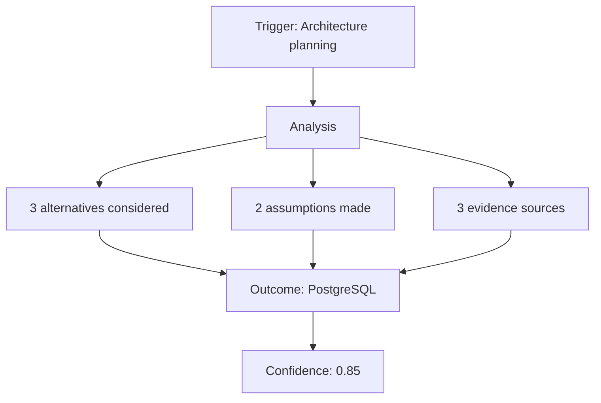
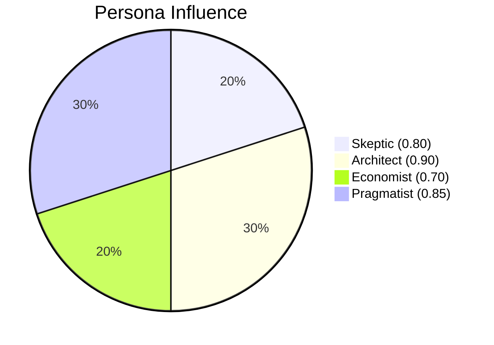
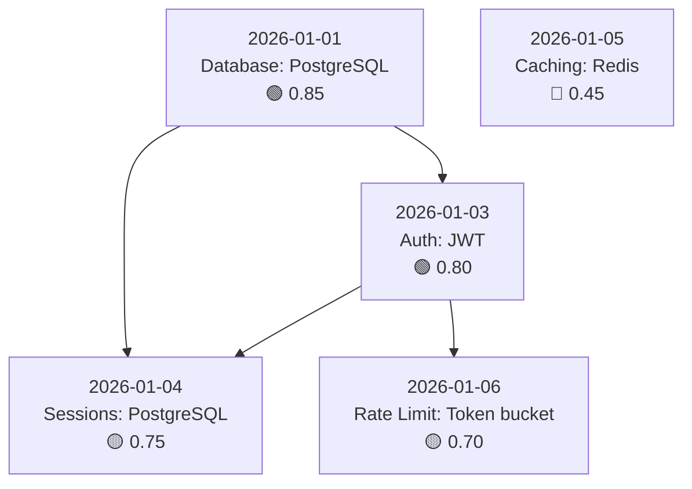
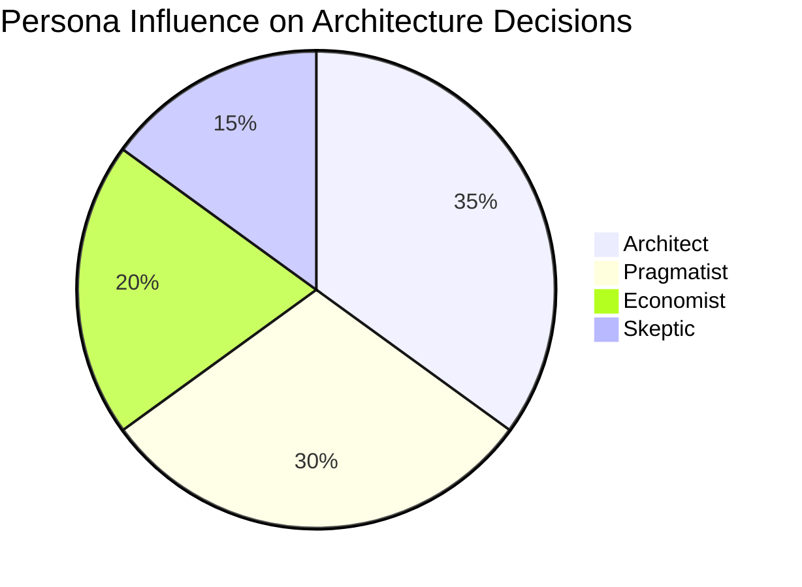

# Visualize Decisions

Generate diagrams showing decision-making processes, persona contributions, and decision timelines.

## Command Format

```
/visualize-decisions <scope> --view <type> [--format <output>] [--filter <criteria>] [--limit <n>]
```

**Arguments:**
- `scope`: Date range, topic, or "all"
  - `last-week`, `last-month`, `this-week`
  - `YYYY-MM-DD:YYYY-MM-DD` (date range)
  - `"topic"` (e.g., "authentication")
  - `all` (everything in index)
- `--view`: Visualization type
  - `process` - Decision workflow
  - `roles` - Persona contributions
  - `events` - Timeline with dependencies
- `--format`: Output format (default: ascii)
  - `ascii` - Text diagrams
  - `mermaid` - Mermaid diagram code
  - `json` - Structured data for external tools
- `--filter`: Additional filtering
  - `topic:X` - Only decisions on topic
  - `confidence:>0.7` - By confidence threshold
  - `has-dependencies` - Only with dependencies
- `--limit`: Max entries (default: 20)

**Examples:**
```
/visualize-decisions last-week --view events --format mermaid
/visualize-decisions "authentication" --view roles --format ascii
/visualize-decisions 2026-01-01:2026-01-06 --view process --format json
/visualize-decisions all --view events --filter confidence:>0.7 --limit 10
```

---

## Views

### Process View

Shows decision-making workflow: trigger → analysis → synthesis → outcome

**What it reveals:**
- How decisions were reached
- What triggered each decision
- Analysis depth applied
- Confidence levels

**ASCII Format:**
```
┌─────────────────────────────────────────────────────────────┐
│ DECISION: Which database for user sessions?                 │
├─────────────────────────────────────────────────────────────┤
│ TRIGGER: Architecture planning (explicit_capture)           │
├─────────────────────────────────────────────────────────────┤
│ ANALYSIS                                                    │
│ ├── Alternatives: 3 considered                              │
│ │   ├── PostgreSQL ✓                                        │
│ │   ├── MongoDB ✗ (no ACID)                                │
│ │   └── Redis ✗ (operational complexity)                   │
│ ├── Assumptions: 2 (1 unvalidated)                         │
│ └── Evidence: 3 sources                                     │
├─────────────────────────────────────────────────────────────┤
│ OUTCOME                                                     │
│ ├── Decision: Use PostgreSQL                                │
│ ├── Confidence: 0.85 ████████░░                            │
│ └── Revisit if: User count exceeds 100K                    │
└─────────────────────────────────────────────────────────────┘
```

**Mermaid Format:**


---

### Roles View

Shows persona contributions and conflicts per decision.

**What it reveals:**
- Which personas influenced decisions
- Confidence levels per persona
- Areas of agreement/disagreement
- Weighted influence

**ASCII Format:**
```
┌─────────────────────────────────────────────────────────────┐
│ DECISION: Microservices vs Monolith                         │
│ Date: 2026-01-05 | Consensus: 0.78                          │
├─────────────────────────────────────────────────────────────┤
│ PERSONA CONTRIBUTIONS                                        │
│                                                              │
│ Skeptic     ████████░░ 0.80  "Claims about scaling unveri..." │
│ Architect   █████████░ 0.90  "Monolith simpler to start"     │
│ Economist   ███████░░░ 0.70  "Microservices cost 3x more"    │
│ Pragmatist  █████████░ 0.85  "Ship monolith, split later"    │
│                                                              │
├─────────────────────────────────────────────────────────────┤
│ CONFLICTS                                                    │
│ ⚠ Architect vs Skeptic: Scaling assumptions unverified      │
├─────────────────────────────────────────────────────────────┤
│ RESOLUTION: Monolith first (Pragmatist + Architect aligned) │
└─────────────────────────────────────────────────────────────┘
```

**Mermaid Format:**


---

### Events View

Shows timeline of decisions with dependencies and causality.

**What it reveals:**
- Decision sequence over time
- Dependency chains
- Clusters of related decisions
- Gaps in decision capture

**ASCII Format:**
```
DECISION TIMELINE: 2026-01-01 to 2026-01-06

2026-01-01 ─┬─ Database selection (PostgreSQL)
            │   └── Confidence: 0.85
            │
2026-01-03 ─┼─ Authentication approach (JWT)
            │   ├── Depends on: Database selection
            │   └── Confidence: 0.80
            │
2026-01-04 ─┼─ Session storage (PostgreSQL sessions)
            │   ├── Depends on: Database selection, Auth approach
            │   └── Confidence: 0.75
            │
2026-01-05 ─┼─ Caching strategy (Redis)
            │   └── Confidence: 0.45 ⚠ LOW
            │
2026-01-06 ─┴─ Rate limiting (Token bucket)
                ├── Depends on: Auth approach
                └── Confidence: 0.70

LEGEND: ─── timeline  ├── dependency  ⚠ low confidence
```

**Mermaid Format:**


---

## Filtering

### By Topic
```
/visualize-decisions all --view events --filter topic:authentication
```

### By Confidence
```
/visualize-decisions last-month --view process --filter confidence:>0.7
/visualize-decisions all --view events --filter confidence:<0.5
```

### By Dependencies
```
/visualize-decisions all --view events --filter has-dependencies
```

### Combined
```
/visualize-decisions 2026-01:2026-02 --view roles --filter topic:database --filter confidence:>0.6
```

---

## Output Formats

### ASCII (Default)

Text-based diagrams that work in any terminal.

**Pros:** Universal compatibility, copy-paste friendly
**Cons:** Limited detail, fixed width

### Mermaid

Diagram code that renders in GitHub, Notion, and markdown viewers.

**Pros:** Beautiful rendered diagrams, interactive
**Cons:** Requires Mermaid support to render

**Usage:**
````markdown
```mermaid
[paste mermaid output here]
```
````

### JSON

Structured data for external visualization tools.

**Pros:** Maximum flexibility, works with D3, Graphviz, etc.
**Cons:** Requires external tooling

**Schema:**
```json
{
  "view": "events",
  "scope": { "from": "2026-01-01", "to": "2026-01-06" },
  "nodes": [
    {
      "id": "2026-01-01-abc123",
      "label": "Database selection",
      "date": "2026-01-01",
      "confidence": 0.85,
      "topic": "database"
    }
  ],
  "edges": [
    {
      "from": "2026-01-01-abc123",
      "to": "2026-01-03-def456",
      "type": "dependency"
    }
  ]
}
```

---

## Process

### Step 1: Parse Scope

Determine date range from scope argument:
- `last-week`: 7 days back from today
- `last-month`: 30 days back
- `YYYY-MM-DD:YYYY-MM-DD`: Explicit range
- `"topic"`: All entries matching topic

### Step 2: Load Index and Entries

1. Read `docs/reasoning/index.json`
2. Apply filters to narrow entries
3. Load matching entries from daily logs
4. Apply `--limit` if specified

### Step 3: Build Visualization Data

Based on `--view`:

**Process:** Extract trigger, analysis depth, outcome per entry
**Roles:** Extract personaContributions, calculate conflicts
**Events:** Build timeline with dependency edges

### Step 4: Render Output

Format based on `--format`:
- ASCII: Generate text diagram
- Mermaid: Generate Mermaid code
- JSON: Output structured data

---

## Defaults for Noisy Data

When visualizing 100+ decisions:

1. **Auto-limit:** Default to 20 entries
2. **Date priority:** Most recent first
3. **Confidence clustering:** Group low-confidence separately
4. **Topic grouping:** Cluster related decisions
5. **Dependency highlighting:** Show critical paths only

---

## Important: Sandbox Exclusion

**NEVER include entries from `docs/reasoning/sandbox/`**

Sandbox contains isolated reconsiderations.
Only visualize from active reasoning logs.

---

## Examples

### Example 1: Weekly Events Timeline

**Input:**
```
/visualize-decisions last-week --view events --format ascii
```

**Output:**
```
DECISION TIMELINE: 2025-12-30 to 2026-01-06

2025-12-30 ─── (no decisions captured)

2026-01-02 ─┬─ Technology stack selection
            │   └── Confidence: 0.90 ████████░░

2026-01-03 ─┼─ Database: PostgreSQL
            │   ├── Depends on: Tech stack
            │   └── Confidence: 0.85 ████████░░

2026-01-05 ─┼─ Auth: JWT tokens
            │   ├── Depends on: Database
            │   └── Confidence: 0.80 ████████░░

2026-01-06 ─┴─ Session handling
                ├── Depends on: Database, Auth
                └── Confidence: 0.75 ███████░░░

─────────────────────────────────────────────
4 decisions | Avg confidence: 0.83
```

### Example 2: Persona Roles for Topic

**Input:**
```
/visualize-decisions "architecture" --view roles --format mermaid
```

**Output:**
````markdown

````
